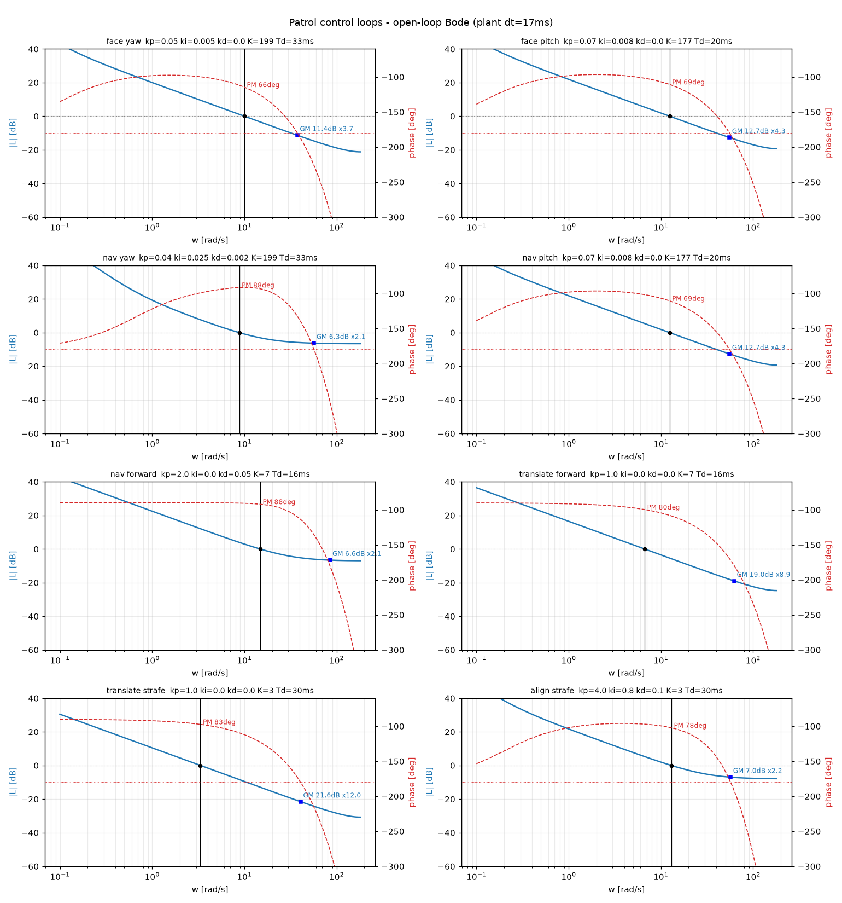

# ゲイン調整メモ

`PatrolGains` のチューニング指針。既定値はここでの検証で決めた。プラントを再同定したら「再検証チェックリスト」を回すこと。

## プラントの要点

軸ごとに `静的な指令→速度マップ + 純むだ時間 + 積分器`。指令はむだ時間のあと定常速度へ階段状に飛ぶ(速度ランプも慣性も無いことは生データで確認済み。system-identification.md)。

| 軸      | 最大速度(\|cmd\|=1) | 不感帯オンセット | むだ時間 | 備考                                    |
| ------- | ------------------- | ---------------- | -------- | --------------------------------------- |
| yaw     | ±200 deg/s          | 0.50             | 33 ms    | 不感帯より上は線形(400 deg/s per cmd)   |
| pitch   | ±180 deg/s          | 0.10             | 20 ms    | 対称(200 deg/s per cmd)                 |
| forward | ±6.00 m/s           | 0.10             | 16 ms    | speed=0.9 で ≈5.3 m/s(6.67 m/s per cmd) |
| strafe  | ±3.00 m/s           | 0.10             | 30 ms    | forward の半分(3.33 m/s per cmd)        |

真値は `不感帯 + 線形` で、上表の丸い数字は VRChat 側の設定値そのもの(同定値は 1% 以内で一致)。同定カーブの散らばりは計測ノイズ。結論に影響しないので作り込む必要はない。理想の折れ線と突き合わせても PM/GM の差は 1% 未満、崖の位置も一致する(余裕解析は不感帯より上を最小二乗で当てて平均し、sim もループが動作点をカーブ上で掃くので均されるため)。

- フレーム周期 dt ≈ 17 ms(15/17.6 ms の二峰性、稀に 0.18 s スパイク)。dt ジッタ/スパイクは全フェーズで実測影響ほぼゼロ(dt キャップ 0.2 s が有効)。
- 静特性カーブは同定時に 3 点メディアン(+等間隔グリッドの端点外挿補正)で孤立外れ点だけ均される。単調性は課さない(カーブは順方向補間にしか使わないので不要)。補正が最大レートの 10% を超えた点があると品質警告が出る。注意: 3 点メディアンは孤立外れ値専用で、隣接 2 レベル連続の異常は除去も検知もできない。プロットの目視確認は省略しないこと。

## ゲイン既定値と検証済み安定範囲

数値は既定値と、検証済みの安定範囲。範囲外の挙動は境界の性質として併記。

### face(正対)

| ゲイン        | 既定  | 安定範囲          | 境界の性質                                                                                                                                                      |
| ------------- | ----- | ----------------- | --------------------------------------------------------------------------------------------------------------------------------------------------------------- |
| turn_kp       | 0.05  | 0.02–0.10         | ≥0.07 でオーバーシュートが 4.5°+ に跳ねる。≥0.15 でハードリミットサイクル(未収束)                                                                               |
| turn_ki       | 0.005 | 0–0.05            | 補償ありならほぼ中立。補償なし時のみ収束を支える(だが3〜10sのクロール)                                                                                          |
| turn_kd       | 0.0   | 0 固定            | D はむだ時間で遅れて逆効果(接近を遅らせリンギング)                                                                                                              |
| turn_deadzone | 0.50  | 実オンセット±0.10 | 過小補償側が危険: 実オンセット0.60で激遅、0.70で完全失速                                                                                                        |
| pitch_kp      | 0.07  | 0.05–0.10         | 上げると公称だけ速くなりストレス下は全条件で遅くなる(0.10 でむだ時間×3 の整定 0.44→0.78s、0.15 は同条件で未収束)。0.03 は補償なしだと失速                       |
| pitch_ki      | 0.008 | 0–0.03            | ほぼ中立                                                                                                                                                        |
| face_tol      | 0.2°  | 0.2–2.0°          | そのまま最終照準の精度になる(下記)。0.15° 以下は公称の整定が伸びる(最大 2.3s、0.1° で 5.7s)。0.05° が絶対下限で、0.02° 以下は補償の底上げ残留振動で settle 不能 |

- turn_kp=0.035 は頑健版: むだ時間の崖が ×4 → ×5 に伸びる。コストは公称 30° で +80ms 程度。既定 0.05 でも崖 ×4・むだ時間×2(66ms)のオーバーシュート 5°(収束は維持、osc 3)なので通常は不要。実機のむだ時間が同定値より大きく伸びる兆候が出たときの逃げ道。
- 補償(deadzone)は必須。外すと kp≤0.05 は失速し、ストレス下では全条件で未収束。代償は tol 境界での小さな底上げキックと精度下限 0.05°。
- 補償フロアは実オンセットちょうどに置く(yaw 0.50 / pitch 0.10)。過大補償側も危険で、0.01 上げるだけで最小指令が有限のレートを持ち tol 付近でハンチングする(0.52/0.12 で公称 11.5s・ストレス下は全条件で未収束)。フロア=オンセットなら最小指令のレートが漸近的に 0 になるので微小整定ができる。
- **face_tol はそのままボタンの外し量になる**(誤差が tol を割った瞬間に `AxisController` が指令を 0 にし、以降どちらの軸も詰めないため)。既定 0.2° は 1.4m で 0.55cm。緩めても速くはならず、範囲上限まで振って整定が縮むのは 50ms 程度。精度の物理下限は「最小有効指令 × dt」で yaw 0.017°・pitch 0.034°/フレーム。HUD は forward を float32 のビットパターンで送るので読み取り側に量子化の床は無い。

### nav(経路追従)

| ゲイン                | 既定       | 安定範囲              | 境界の性質                                                                                                                             |
| --------------------- | ---------- | --------------------- | -------------------------------------------------------------------------------------------------------------------------------------- |
| nav_turn_kp           | 0.04       | 0.03–0.05             | 補償前提の値。0.03 はゲイン誤差×1.5でむしろ悪化、0.05 は公称良だが osc↑                                                                |
| nav_turn_ki           | 0.025      | 0–0.06                | ilim 0.5 がワインドアップを防ぐ。補償後は出口の巻き戻しも速い                                                                          |
| nav_turn_kd           | 0.002      | 0–0.004               | 0.004 は補償下で有害(D のマイクロスパイクが底上げを跨いでフル不感帯キック→階段再導入)。0 はむだ時間×2で osc/オーバーシュートが先に出る |
| nav_turn_deadzone     | 0.50       | 実オンセット±0.10     | face と同運用。tol は入れない(補償に不感帯を再導入し、kp≥0.05 でリミットサイクルを誘発する実測)                                        |
| nav_lookahead         | 1.2        | 0.8–2.5               | 小=追従タイト・円弧定常誤差大(L0.8で8.2°)/ 大=内切り増(L2.5で xtrack 0.41m)。急ジグザグ・狭所は 0.8                                    |
| fwd_kp                | 2.0        | 1–8(下限 0.29 ハード) | fwd_kp·arrive_radius < 不感帯 0.10 だと到達半径の外で失速(後退なし・補償なしのため)。0.25 は 0.40m でスタック実証                      |
| fwd_kd                | 0.05       | 0–0.2                 | 影響軽微                                                                                                                               |
| speed / arrive_radius | 0.9 / 0.35 | —                     | speed↑=コーナー内切り↑(0.5→1.0 で xtrack 0.27→0.68m)。arrive_radius↑=速いが最終点から遠い(final_gap≈½·arrive_radius)                   |

- 補償フロア=実オンセット一致が生命線(face と同じ弱点構造)。再同定でオンセットが動いたら nav_turn_deadzone を必ず追従させる。マウス視点(不感帯なし)では 0 に。
- carrot を入れるとコーナーが丸まり、forward_factor の失速も併せて消えた(S字の fwd_dip 0.52→0.04)。真のヘアピン(>120°)だけは減速が残るが回復は速い。
- 密な階段状ポリライン(A\*出力)では osc 指標が上がるが角加速度は低い(指標アーチファクト)。気になる場合は経路平滑化か nav_lookahead↑で低減。
- kd はわずかな時短と、acc_rms や GM の悪化との交換。0→0.002 で総時間 −4% のかわりに acc_rms が全ゲイン誤差レベルで 2〜3 割増え、GM は ×4.2→×2.5 に減る。0〜0.002 はどれも収束基準を満たすので好みの範囲。kd↑で耐性が上がることはない。
- 実機の yaw 応答が同定値(400 deg/s per cmd)より速い兆候があれば kp を下げる。

### nav pitch(移動中の pitch 事前整合)

移動(goto / translate_to)中に、到着後に押すボタンへ pitch を先合わせしておく軸。yaw は経路方向を追うが pitch は独立 look 軸なので干渉しない。到着後の照準(face/align)が詰める pitch 残差を減らして正対フェーズを短縮する。pitch_at 未指定なら動かない(従来動作)。

| ゲイン             | 既定  | 安定範囲          | 境界の性質                                                                                          |
| ------------------ | ----- | ----------------- | --------------------------------------------------------------------------------------------------- |
| nav_pitch_kp       | 0.07  | 0.05–0.10         | face pitch と同値・同機構。線形マージンも face pitch と一致(上表: PM 69°/GM ×4.3/余裕むだ時間 97ms) |
| nav_pitch_ki       | 0.008 | 0–0.03            | ランプ目標の追従ラグを詰める向き。上げすぎは終盤オーバーシュート                                    |
| nav_pitch_kd       | 0.0   | 0 固定            | face pitch と同じく D は遅れて逆効果                                                                |
| nav_pitch_deadzone | 0.10  | 実オンセット±0.10 | pitch 実オンセット一致が生命線(face pitch と共通)。**tol は入れない**(nav_turn と同じ理由)          |

- 目標 pitch は視点→ボタンの仰角だが、水平距離を **standoff で下限クランプ**する(`pitch_error(..., min_horiz=standoff)`)。真下付近を通っても ±90° へ発散せず、到着地点(正面 standoff)の最終仰角に一致する。最終照準側はクランプ無し(真値が要る)。
- **tol を入れない**のは nav_turn と同構造の理由: 目標が毎フレーム動き、ループは到着まで回り続けるため、tol 境界を目標が出入りするたびに指令が 0⇔補償フロアでトグルしてリミットサイクルを誘発する。フロア=オンセットなので tol 無しでも最小指令のレートは漸近 0。
- sim 実測(合成プラント、goto/translate × dy=+1.9〜−1.0m × むだ時間 ×1.0/1.5/2.0):全ケース到達、崖なし。到着 pitch 残差は 2〜6.5°(先合わせ無しは 37〜48°)で、続く aim が |err|<1° に入るまで ~0.95s→~0.25s。視点固定 translate(到着後 yaw 誤差ゼロ=pitch 律速)ではこの短縮がそのままエンドツーエンドに効く。
- osc 指標は 6〜14 と高く出るが発振ではない。接近中盤の追従ラグは ~1°(不感帯補償の有界な微振動が符号反転を稼ぐ指標アーチファクト)、残差は終盤ランプ(到着直前に目標仰角が最速で動く)のラグで、振幅はむだ時間 ×2 でも有界。
- 事前整合は「最初に押すボタン」1個ぶん(approach/activate は対象ボタン、複数ボタンを叩く stop は先頭)。2個目以降は通常どおり照準し直す。

### hold-view 並進(translate_to) / align(最終照準)

| ゲイン          | 既定    | 安定範囲 | 境界の性質                                                                                                                             |
| --------------- | ------- | -------- | -------------------------------------------------------------------------------------------------------------------------------------- |
| translate_kp    | 1.0     | 0.5–2.5  | 失速下限は方向依存: 軸沿い 0.29(=0.10/arrive_radius)、斜め45°は 0.45(誤差が両体軸に分割されるため)。kp↑は 2.2 以上で頭打ち(到達はする) |
| translate_kd    | 0.0     | 0 固定   | 0.1 で GM ×9.0→×1.4・ゲイン誤差の崖 ×8→×1.75、しかも遅く osc も増える(理由は理論節の D 項)                                             |
| strafe_kp       | 4.0     | 1–8      | kp=8 で軽微振動、kp=12 でリミットサイクル(タイムアウト)                                                                                |
| strafe_ki       | 0.8     | 0–2.0    | ilim 0.3＋条件付き積分で破綻しない                                                                                                     |
| strafe_deadzone | 0.10    | 必須     | 純Pだと kp·align_tol=0.02 ≪ 0.10 で失速。補償なしでも ki が救うが7倍遅い(0.15s→1.08s)。実機ノイズ下では失敗しうる                      |
| align_tol       | 0.005 m | ≥0.005   | 健全時は face の残差(1.4m で 0.55cm)が既に内側なので発火しない。締めるほど視点軸劣化時の保険が効く(下記)                               |

- align は健全時には発火せず、視点軸が劣化したときだけ効く保険。face が収束していれば横ずれは face_tol 相当(1.4m で 0.55cm)しかなく、align は指令ゼロのまま数フレームで抜ける。価値が出るのは turn_deadzone の過小補償で視点軸が失速したときで、strafe は別軸・別オンセット(0.10)なので生き残る。yaw の実オンセットが 0.70(完全失速)まで劣化した sim で、align 無効なら外し 8.0cm、align_tol=0.005 なら 0.7cm。締めるほど保険の効く劣化幅が広がり、健全時のコストは増えない(発火しないため)。
- スタック検出は窓内の経路長(Σ|Δpos|)基準(その場往復や微速移動を stuck 扱いしない)。真の失速は約2sで検出。発振は stuck 扱いにならず align_timeout(8s)まで走るので、収束不能ケースの検出は最大数秒遅くなる。ただし誤分類はしない。頻発するなら align_timeout 短縮で緩和。

## 理論クイックリファレンス(ゲインを動かすときの見積り)

全ループが `PID → 不感帯補償 → むだ時間 → 静特性 → 積分器` で、補償が実オンセットをちょうど打ち消すので、小信号ループゲインは K = (1−不感帯) × 不感帯より上の傾き になる。交差周波数は ωc ≈ kp·K。**kp を上げると ωc が比例して上がり、むだ時間余裕が反比例で減る。**これが全フェーズ共通の劣化メカニズム。

下表は離散 PID と ZOH 等価プラント(むだ時間の分数遅れ込み)を z 平面で厳密に評価した値。

| ループ            | ωc [rad/s] | PM  | GM             | 追加むだ時間余裕 |
| ----------------- | ---------- | --- | -------------- | ---------------- |
| face yaw          | 10.0       | 66° | 11.4 dB(×3.7)  | +114 ms          |
| face pitch        | 12.4       | 69° | 12.7 dB(×4.3)  | +97 ms           |
| nav yaw           | 8.8        | 88° | 6.3 dB(×2.1)   | +175 ms          |
| nav pitch         | 12.4       | 69° | 12.7 dB(×4.3)  | +97 ms           |
| nav forward       | 14.8       | 88° | 6.6 dB(×2.1)   | +104 ms          |
| translate forward | 6.7        | 80° | 19.0 dB(×8.9)  | +211 ms          |
| translate strafe  | 3.3        | 83° | 21.6 dB(×12.0) | +433 ms          |
| align strafe      | 13.0       | 78° | 7.0 dB(×2.2)   | +104 ms          |

上表は `bode-margins` が plant.json から再生成する(下図。プラントを再同定したら数値がずれるので測り直すこと)。ωc/PM/追加むだ時間余裕は本表と一致し、GM だけむだ時間の離散化の違いで 1〜2 dB 前後する。



```bash
uv run bode-margins --model logs/probe_<日時>/plant.json --out docs/loop-bode.png
```

D 項は PM を稼ぐが GM を落とす。離散微分の高周波ゲインは 2·kd/dt まで伸びる(dt=17ms なら kd の 117 倍)ので ω180 付近のゲインを直接押し上げ、PM が 100° あっても GM が 1.5 を割ることがある。割に合うのは打ち消すべき遅れがあるときだけで、このプラントは積分器+純むだ時間なので該当しない。kd を足したくなったら GM を確認する。

GM はプラントゲインが何倍になったら不安定かを表す量なので、ゲイン誤差ストレスの崖と直接対応する。補償の無い軸(translate)は予測 ×9.0 に対し崖 ×8 とよく一致し、補償のある軸(face yaw / align)は補償の u=0 での飛びが線形モデルに見えないぶん 2 割ほど楽観に出る。

ki の位相遅れは全ループで無視できる規模(ki/kp ≪ ωc)。ki は安定性でなく定常偏差・不感帯突破の道具として扱う。

## ロバスト性エンベロープ(既定ゲイン、実測)

収束を維持できる範囲(sim 実測)。

| 摂動                     | face      | nav       | align    | エンドツーエンド visit |
| ------------------------ | --------- | --------- | -------- | ---------------------- |
| むだ時間倍率             | ≤4×       | ≤8×       | ≤4×      | ≤4×                    |
| プラントゲイン誤差       | 0.2–3×    | 0.2–8×    | 0.2–4×   | 0.2–3×                 |
| yaw 不感帯オンセットずれ | 補償±0.10 | 補償±0.10 | —        | face に準ずる          |
| dt ジッタ/スパイク       | 影響なし  | 影響なし  | 影響なし | 影響なし               |

エンベロープが最も狭いのは face yaw と align(ともに むだ時間 ×4)で、face yaw がゲイン誤差 ×3 も持つぶんエンドツーエンドの上限を決める。実機で watch すべきは (1) むだ時間の増加、(2) yaw 不感帯の過小推定(実オンセット ≥0.60 で劣化開始)。実機がモデルより遅い側のゲイン誤差では失敗しない。危険なのは速い側。

GM が最小なのは nav yaw / nav forward(×2.1)と align strafe(×2.2)。収束は保つが振動しやすい順序はこちらなので、実機で揺れが出たらまずこの2つを疑う。

## チューニング手順

### 実行環境

sim の回し方とストレス手法、指標の定義と基準値は [verification.md](verification.md)。要点:

- 全ループはヘッドレス実行可: `SimulatedVRChat`(src/vrc_autopilot/sysid/sim_plant.py)が reader/look/move の3役、`SimClock` を clock に渡すと仮想時間で高速に回る。呼び出しパターンは tests/test_sysid.py の `test_all_control_loops_run_against_sim` が実例。
- **1試行ごとに sim とコントローラを必ず作り直す**(両方状態を持つ)。**複数フェーズ連結時は SimClock を共有する**(作り直すと見かけの巨大 dt で align の stuck 検出が誤発火する)。
- むだ時間ストレスは読込済みモデルの deadtime_s をスケール、ゲイン誤差ストレスは points の rate 側をスケール(メモリ上で。JSON は書き換えない)。
- 指標は AxisMetrics(recording.py)。osc(符号反転回数)が振動の主指標で 2–3 以下が目安、2桁は発振。settle_time=None は未収束。同成績なら effort が小さい方。注意: 複数ウェイポイント経路では yaw_over/peak に目標側変わりが混ざる(終端オーバーシュートではない)。box 経路の並進 overshoot も脚長のアーチファクト。

### 探索の作法

1. 1変数ずつ。順序は deadzone → kp → ki → kd(事故が少ない)。
2. 各候補は小誤差(2–5°/短距離)と大誤差(30–179°/長距離)の両方で評価。小誤差は tol 境界の挙動(補償キック)、大誤差は引き込みと飽和からの復帰を見る。
3. 生き残った候補にむだ時間×1.5〜×2 ストレスを必ずかける。名目性能が同等ならストレス耐性が高い方を採る(kp が低い側が勝つのが通例)。
4. 発振判定は osc が増えたかより、収束するかを優先。不感帯＋飽和のおかげで線形不安定でも振幅有界のまま到達するケースがある(nav yaw、translate kp=8)。マージンを使い切って辛うじて立っているだけなので採用しない。
5. 受け入れ基準の目安: 全対象シナリオ収束 100%、osc≤3、オーバーシュートが tol 比で小さい、×1.5 ストレスで劣化が連続的(崖がない)。

### プラント再同定後の再検証チェックリスト

1. 同定/読込時にメディアン補正警告やセグメント棄却警告が出ないか(出たらプローブデータの品質を先に疑う)。
2. 不感帯オンセットを読み直し、turn/pitch/strafe/nav_turn_deadzone をオンセットちょうどに更新。下回る設定は失速側で危険、上回るのは±0.10まで許容。
3. 移動軸の cmd=1 速度とむだ時間を読み直し、worldcal の REF_SPEED / REF_DEADTIME_S を更新(ワールド速度キャリブレーションの基準)。
4. fwd_kp·arrive_radius > 新不感帯、translate_kp·arrive_radius > 新不感帯·√2 を確認(失速下限)。
5. face yaw の小誤差(2–5°)収束と、むだ時間×2 での収束を確認。
6. 各軸の最大速度が大きく変わったら kp を反比例で当たりを付けてから微調整(ωc ≈ kp·K を一定に保つ)。

### 実機答え合わせ

sim と実機は同じ制御コードを通るので指標も同じ計算。実機で face の yaw_err が tol 前後で往復し turn が ±0.50 を行き来していたら face yaw の振動。turn_p/turn_i/turn_d の内訳でどの項が暴れているか分かる。**sim と実機で食い違ったらゲインでなくモデルを疑う**(静特性の再プロット、むだ時間、そして sim に無い慣性やノイズの有無)。look をマウス入力にする場合は不感帯が無いので deadzone 0、ゲインは別物として再調整。
